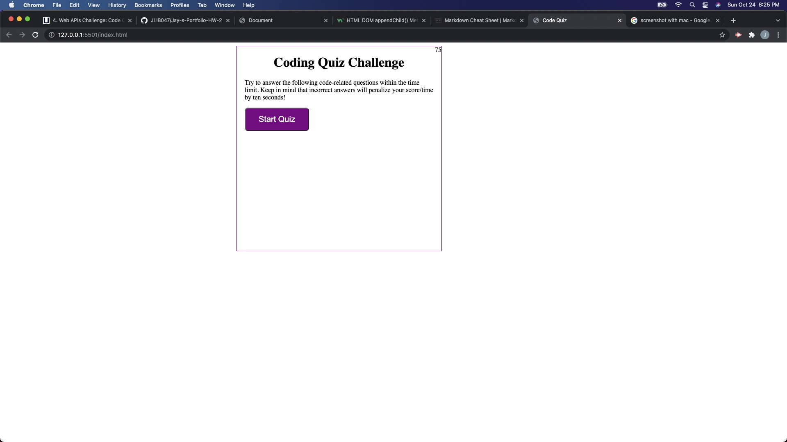
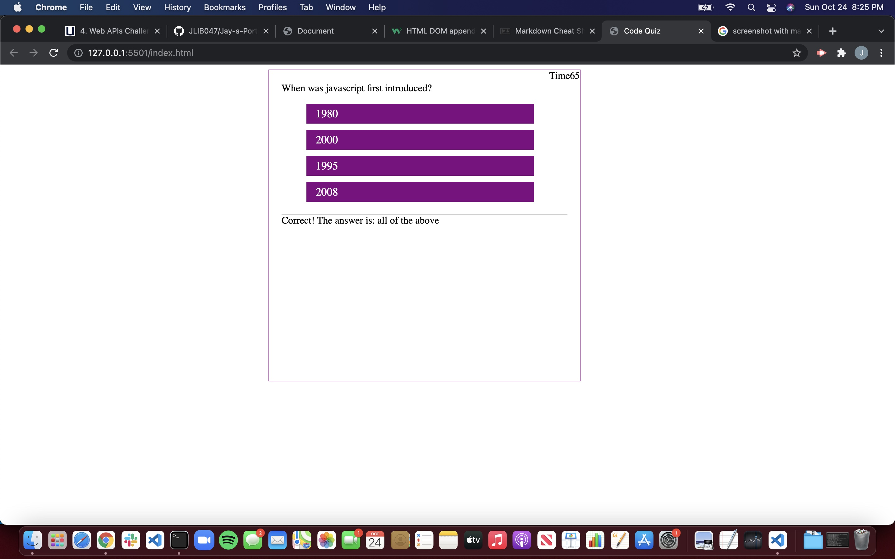
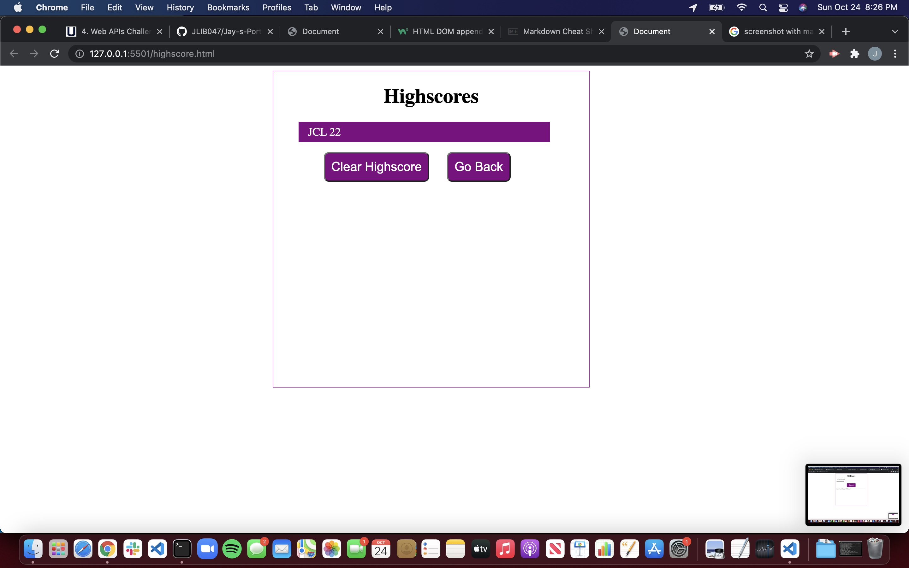

# Code Quiz Homework Challenge 4 

## Purpose 
The purpose of the project is to create a quix about what we've learned in the last 5 weeks of the bootcamp.  This quiz is supposed to loop through an array of 5 questions letting you know what you've gotten right or wrong after each question.  Once you are done with the quiz you will be able to save your scores via local storage and continue back to the game.  

## Built With 
- HTML
- CSS
- JavaScript
- Web API's 

## Website Screen Shot w/ Link 

https://jlib047.github.io/Code-Quiz-HW-4-/index.html

## Contribution 
Created and designed by Jason Libertelli